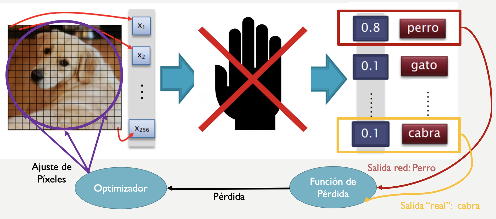

## Índice

1. [📝 Introducción](#Introducción)
2. [✅ Características](#Características)
3. [📎 Ejemplos](#Ejemplos)
4. [🛠 Realizando un Ataque Adversario](#Realizando_Un_Ataque_Adversario)
5. [👀 Ataque 1: Percibiendo las modificaciones realizadas](#Ataque_1_Percibiendo_Las_Modificaciones_Realizadas)
6. [🙈 Ataque 2: Sin percibir las modificaciones realizadas](#Ataque_2_Sin_Percibir_Las_Modificaciones_Realizadas)
7. [🌇 Visualizando el ataque](#Visualizando_El_Ataque)
8. [🖼 Comparando las imágenes de ambos ataques](#Comparando_Las_Imágenes_De_Ambos_Ataques)
9. [💥 Visualizando El Ruido De Las Imágenes Atacantes](#Visualizando_El_Ruido_De_Las_Imágenes_Atacantes)
10. [⚙️ Estructura Del Repositorio](#Estructura_Del_Repositorio)

Repsoitorio en el que se incluye la presentación y el notebook utilizado para la charla: **Ataques Adversarios: Como engañar una red neuronal** presentada en el evento organizado por Segovia Tech Train el día 21/02/2020.

# 📝 Introducción <a name="Introducción"></a>

Un ataque adversario es una imagen (aparentemente normal) a la que se le ha agregado ruido (intencionadamente preparado), de tal forma que la nueva imagen generada es capaz de engañar a la red haciendo que esta la clasifique como una clase totalmente distinta a la clase de la imagen original (Ver Figura 1).


**Figura 1: Ejemplo de Ataque Adversario.**

## ✅ Características <a name="Características"></a>
Alguna de las características de los ataques adversarios son las siguientes:

* Se generan añadiendo ruido de manera premeditada a la imagen original.
* Generalmente las modificaciones que se realizan son imperceptibles para el ojo humano.
* No es necesario tener disponible el modelo a atacar.
* Altera tanto la salida de la red que hace que las demás clases no se tengan en cuenta.
* Es propagable: Existe la posibilidad de que un ataque que haya funcionado con un modelo funcione también para otro.

## 📎 Ejemplos <a name="Ejemplos"></a>

**Figura 2: Ejemplo de Ataque Adversario.**

**Figura 3: Ejemplo de Ataque Adversario.**

# 🛠 Realizando un ataque adversario <a name="Realizando_Un_Ataque_Adversario"></a>

La forma en la que se va a realizar el ataque es muy similar a la forma utilizada para entrenar una red neuronal:

* **Entrenamiento de la red:** Calculamos el error de la red a partir de la salida proporcionada por esta y la salida esperada y ajustamos los pesos de la red con el objetivo de disminuir el error.
* **Ataque Adversario:** Dado que no podemos modificar los parámetros de la red, calculamos la diferencia entre la salida real de la red y la nueva clase (clase que queremos que nos devuelva la red en el ataque), y modificamos los píxeles de la imagen para disminuir esa diferencia hasta que finalmente "confundamos" a la red (Ver Figura 4).


**Figura 4: Esquema del ataque a realizar.**

````python
def generarAtaqueAdversario(img , claseDestino , tasaErrorRed = 0.95 , cotaInf = 0.01 , cotaSup = 0.01 , percibirCambios = True ):

capa_entrada = modelo.layers[0].input  # Cogemos la capa de entrada del modelo
capa_salida = modelo.layers[-1].output # Cogemos la capa de salida del modelo

probabilidad_nueva_clase = capa_salida[0 , claseDestino] # Guardamos en la variable el % que nos devuelve la red para la clase con la que queremos engañarla

# La variable optimizador contendrá las modificaciones que tenemos que realizar sobre la imagen
optimizador = K.gradients(probabilidad_nueva_clase , capa_entrada)[0] # Definimos el descenso por gradiente entre la perdida y la entrada que le pasemos

# Definimos la función gradiente en la que pasandole la entrada del modelo, nos devuelve el gradiente (modificación que tenemos que realizar en la imagen para optimizar el error) y la pérdida --> El % de error de la red con respecto a los cambios realizados

funcion_modificadora = K.function([capa_entrada , K.learning_phase()], [optimizador , probabilidad_nueva_clase])

imagenMod = np.copy(img) # Creamos una copia de la imagen original para realizar en ella las modificaciones

error_red = 0.0

# Definimos las cotas superior e inferior de los parámetros para que las modificaciones no sobrepasen ese intervalo y conseguir así que las modificaciones sean tan pequeñas que sean imperceptibles para el ojo humano 

max_mod = img + cotaSup
min_mod = img - cotaInf

tiempo_inicial = time() # Guardamos el instante de tiempo en que se inicia el bucle para calcular luego la duración de todo el proceso

iteraciones = 0 # Vemos cuantas modificaciones realizamos sobre la imagen para conseguir confundir a la red

while error_red < tasaErrorRed:

# Utilizamos la función definida anteriormente para obtener el incremento que hay que realizar sobre la imagen y la pérdida (error) de la red con la imagen que le proporcionamos antes de modificar
ruido , error_red = funcion_modificadora([imagenMod , 0])

imagenMod += ruido # Realizazmos las modificaciones sobre la imagen

if percibirCambios == False:
# Fijamos los valores de la imagen para que no puedan aumentar ni disminuir de la cota definida anteriormente 
imagenMod = np.clip(imagenMod , min_mod , max_mod)
# Fijamos los valores de -1 y 1 para que las modificaciones no se salgan del rango en el que se encuentra definida la imagen 
imagenMod = np.clip(imagenMod , -1 , 1)

clear_output(wait=True) # Limpiamos la salida en cada iteración para que se vea mejor todo

iteraciones += 1

print("Error de la Red: {}".format(error_red)) # Mostramos el error que estamos obteniendo con las modificaciones

tiempo_final = time() # Volvemos a obtener el tiempo a la salida del bucle

tiempo_ejecucion = tiempo_final - tiempo_inicial # Calculamos el tiempo de ejecucion de todo el proceso

print("=======================================================================================================")
print("El tiempo de ejcución ha sido: {:.2f} segundos".format(tiempo_ejecucion)) # Mostramos el tiempo que ha durado todo el proceso de modificación
print("Se han realizado {} modificaciones sobre la imagen".format(iteraciones))

return imagenMod
````
### 👀 Ataque 1: Percibiendo las modificaciones realizadas <a name="Ataque_1_Percibiendo_Las_Modificaciones_Realizadas"></a>

````python
img_mod1 = generarAtaqueAdversario(img = img_original , claseDestino=69 , percibirCambios=True) # Clase 69 = trilobites
normalizar(img_mod1 , normalizar=False) # Ponemos la imagen en escala (0 - 255) para poder visualizarla a color

Error de la Red: 0.9543400406837463
===============
El tiempo de ejcución ha sido: 57.67 segundos
Se han realizado 1394 modificaciones sobre la imagen
````

**Figura 5: Imagen modificada-maliciosa (sin establecer cotas => Se perciben las modificaciones).**

````python
prediccion_mod1 = predecir(img_mod1)
('n01768244', 'trilobite', 0.98919684)
('n01990800', 'isopod', 0.0011814345)
('n04153751', 'screw', 0.0010408305)
('n04335435', 'streetcar', 0.00077220594)
('n02112137', 'chow', 0.0006552407)
````

### 🙈 Ataque 2: Sin percibir las modificaciones realizadas <a name="Ataque_2_Sin_Percibir_Las_Modificaciones_Realizadas"></a>

````python
img_mod2 = generarAtaqueAdversario(img = img_original , claseDestino=69 , percibirCambios = False) # Clase 963 = trilobites
normalizar(img_mod2 , normalizar = False) # Ponemos la imagen en escala (0 - 255) para poder visualizarla a color
Error de la Red: 0.984582781791687
===================
El tiempo de ejcución ha sido: 59.24 segundos
Se han realizado 1423 modificaciones sobre la imagen
````

**Figura 6: Imagen modificada-maliciosa (estableciendo cotas => No se perciben las modificaciones).**

````python
prediccion_mod2 = predecir(img_mod2)

('n01768244', 'trilobite', 0.99067444)
('n01990800', 'isopod', 0.001335547)
('n04153751', 'screw', 0.0007065134)
('n04209133', 'shower_cap', 0.00042699734)
('n02112137', 'chow', 0.00032047805)
````

# 🌇 Visualizando el ataque <a name="Visualizando_El_Ataque"></a>

## 🖼 Comparando las imágenes de ambos ataques <a name="Comparando_Las_Imágenes_De_Ambos_Ataques"></a>

Realizamos una comparativa entre ambos ataques y la imagen original.


**Figura 7: Comparativa entre la imagen original y la imagen atacante en la que se pueden percibir las modificaciones realizadas.**


**Figura 8: Comparativa entre la imagen original y la imagen atacante en la que NO se pueden percibir las modificaciones realizadas.**

## 💥 Visualizando el ruido de las imágenes atacantes <a name="Visualizando_El_Ruido_De_Las_Imágenes_Atacantes"></a>

Realizamos una comparativa entre ambos ataques y la imagen original visualizando el ruido generado para realizar el ataque.


**Figura 9: Comparativa entre la imagen original y la imagen atacante en la que se pueden percibir las modificaciones realizadas (visualizando el ruido generado por el ataque).**


**Figura 10: Comparativa entre la imagen original y la imagen atacante en la que NO se pueden percibir las modificaciones realizadas (visualizando el ruido generado por el ataque).**

# ⚙️ Estructura del repositorio <a name="Estructura_Del_Repositorio"></a>

El repositorio se encuentra estructurado de la siguiente forma:
````
.
├── assets/ # Imágenes del README
├── AtaquesAdversarios.ipynb # Notebook con el código y el ejemplo para realizar el ataque
├── Presentacion Ataques Adversarios.pdf # Presentación de la charla en formato .pdf
├── README.md
└── requirements.txt # Dependencias python para ejecutar la herramienta
`````
